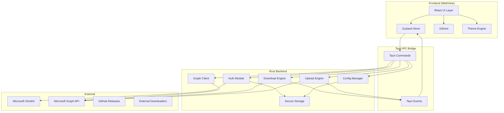
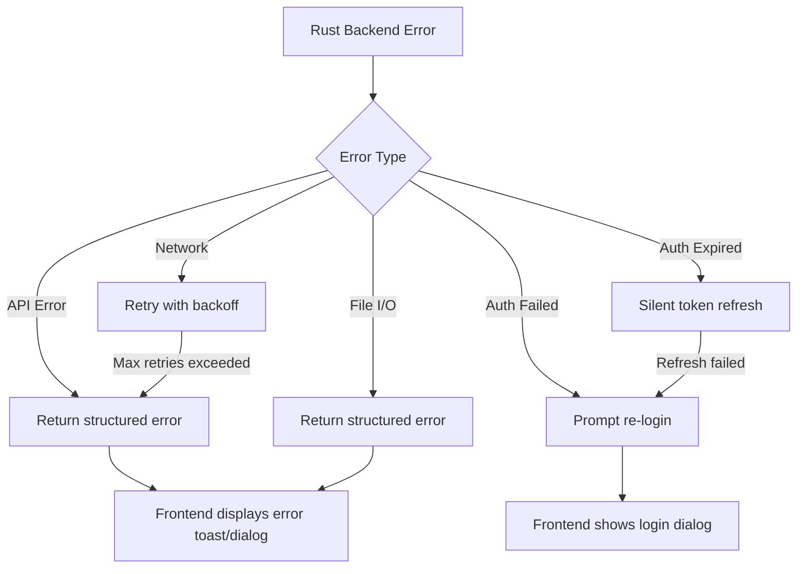

# Design Document: Tauri Rewrite

## Overview

ShareOneList is being rewritten from a WinUI 3 (.NET/C#) desktop application to a cross-platform application using Tauri 2.x (Rust backend + web frontend). The rewrite preserves all existing functionality—OneDrive/SharePoint file management with dual cloud support (Global and 21Vianet)—while extending platform support to macOS (Apple Silicon) alongside Windows.

### Key Design Decisions

1. **Tauri 2.x** chosen over Electron for smaller binary size, native performance, and Rust's memory safety guarantees for backend logic (auth, file I/O, chunked transfers).
2. **Frontend**: React + TypeScript with Vite bundler. React provides a mature component ecosystem, excellent state management options, and wide community support for i18n/theming.
3. **State Management**: Zustand for lightweight, TypeScript-friendly global state (accounts, tasks, settings).
4. **IPC**: Tauri's command system (`#[tauri::command]`) for frontend–backend communication, with typed payloads serialized via serde.
5. **Graph API**: Direct HTTP calls via `reqwest` in Rust (no SDK dependency) for full control over auth headers, chunked uploads/downloads, and endpoint switching between Global/China environments.
6. **Secure Storage**: Platform keychain integration via the `keyring` crate (Windows Credential Manager, macOS Keychain) for refresh tokens.
7. **Persistent Config**: JSON files in platform-appropriate app data directories via Tauri's `app_data_dir` API.

### Technology Stack

| Layer | Technology | Purpose |
|-------|-----------|---------|
| App Framework | Tauri 2.x | Native shell, IPC, system APIs |
| Backend | Rust | Auth, Graph API, file I/O, download/upload engine |
| Frontend | React 18 + TypeScript | UI rendering |
| Bundler | Vite | Dev server, production builds |
| State | Zustand | Frontend state management |
| HTTP | reqwest | Backend HTTP client |
| Styling | Tailwind CSS + shadcn/ui | Component library with dark/light theme |
| i18n | react-i18next | Internationalization |
| Secure Storage | keyring (Rust crate) | Platform keychain for tokens |

## Architecture



### Layer Responsibilities

- **Frontend (WebView)**: Renders UI, manages view state, dispatches commands to backend, subscribes to events for real-time updates (transfer progress).
- **Tauri IPC Bridge**: Typed command handlers (`invoke`) for request/response patterns; event channels (`emit`/`listen`) for streaming updates (download progress, upload progress).
- **Rust Backend**: All business logic—authentication flows, Graph API communication, chunked file transfers, configuration persistence, secure token storage.

### Data Flow Patterns

1. **Request/Response** (file listing, search, create folder): Frontend `invoke`s a Tauri command → Rust handler calls Graph API → returns typed result to frontend.
2. **Streaming** (download/upload progress): Rust spawns an async task → periodically emits progress events → frontend store updates UI reactively.
3. **Background Refresh** (token refresh): Rust auth module monitors token expiry → proactively refreshes → no frontend involvement unless re-auth is needed.

## Components and Interfaces

### Backend Modules (Rust)

#### Auth Module (`src-tauri/src/auth/`)

```rust
pub struct AuthModule {
    sessions: HashMap<CloudEnvironment, AuthSession>,
}

pub struct AuthSession {
    pub cloud_env: CloudEnvironment,
    pub client_id: String,
    pub access_token: String,
    pub refresh_token: String,
    pub expires_at: DateTime<Utc>,
    pub home_account_id: String,
    pub display_name: String,
}

pub enum CloudEnvironment {
    Global,
    China,
}

impl AuthModule {
    pub async fn login(&mut self, cloud_env: CloudEnvironment) -> Result<AuthSession, AuthError>;
    pub async fn logout(&mut self, cloud_env: CloudEnvironment) -> Result<(), AuthError>;
    pub async fn get_token(&mut self, cloud_env: CloudEnvironment) -> Result<String, AuthError>;
    pub async fn refresh_token_if_needed(&mut self, cloud_env: CloudEnvironment) -> Result<(), AuthError>;
}
```

#### Graph Client (`src-tauri/src/graph/`)

```rust
pub struct GraphClient {
    http: reqwest::Client,
    cloud_env: CloudEnvironment,
}

impl GraphClient {
    pub fn new(cloud_env: CloudEnvironment) -> Self;
    fn base_url(&self) -> &str;

    // Drive operations
    pub async fn get_drive(&self, drive_id: &str, token: &str) -> Result<Drive, GraphError>;
    pub async fn list_children(&self, drive_id: &str, item_id: &str, token: &str) -> Result<Vec<DriveItem>, GraphError>;
    pub async fn search(&self, drive_id: &str, query: &str, scope: SearchScope, token: &str) -> Result<Vec<DriveItem>, GraphError>;

    // File operations
    pub async fn rename_item(&self, drive_id: &str, item_id: &str, new_name: &str, token: &str) -> Result<DriveItem, GraphError>;
    pub async fn delete_item(&self, drive_id: &str, item_id: &str, token: &str) -> Result<(), GraphError>;
    pub async fn create_folder(&self, drive_id: &str, parent_id: &str, name: &str, token: &str) -> Result<DriveItem, GraphError>;
    pub async fn create_share_link(&self, drive_id: &str, item_id: &str, options: ShareOptions, token: &str) -> Result<String, GraphError>;
    pub async fn convert_format(&self, drive_id: &str, item_id: &str, format: &str, token: &str) -> Result<Vec<u8>, GraphError>;

    // SharePoint
    pub async fn search_sites(&self, token: &str) -> Result<Vec<Site>, GraphError>;
    pub async fn get_sites_via_groups(&self, token: &str) -> Result<Vec<Site>, GraphError>;
    pub async fn get_site_drives(&self, site_id: &str, token: &str) -> Result<Vec<Drive>, GraphError>;
    pub async fn get_shared_drives(&self, token: &str) -> Result<Vec<Drive>, GraphError>;

    // Preview
    pub async fn get_preview_url(&self, drive_id: &str, item_id: &str, token: &str) -> Result<String, GraphError>;
    pub async fn get_quota(&self, drive_id: &str, token: &str) -> Result<DriveQuota, GraphError>;
}
```

#### Download Engine (`src-tauri/src/transfer/download.rs`)

```rust
pub struct DownloadEngine {
    tasks: HashMap<TaskId, DownloadTask>,
    concurrency_limit: usize, // default: 8 parallel chunks
}

pub struct DownloadTask {
    pub id: TaskId,
    pub file_name: String,
    pub drive_id: String,
    pub item_id: String,
    pub local_path: PathBuf,
    pub total_bytes: u64,
    pub downloaded_bytes: AtomicU64,
    pub status: TaskStatus,
    pub download_url: String,
    pub url_obtained_at: DateTime<Utc>,
    pub chunks: Vec<ChunkState>,
}

pub enum TaskStatus {
    Queued,
    Downloading,
    Paused,
    Completed,
    Failed(String),
}

impl DownloadEngine {
    pub async fn create_task(&mut self, params: DownloadParams) -> Result<TaskId, TransferError>;
    pub async fn pause_task(&mut self, id: TaskId) -> Result<(), TransferError>;
    pub async fn resume_task(&mut self, id: TaskId) -> Result<(), TransferError>;
    pub async fn cancel_task(&mut self, id: TaskId) -> Result<(), TransferError>;
    pub fn get_progress(&self, id: TaskId) -> Option<ProgressInfo>;
}
```

#### Upload Engine (`src-tauri/src/transfer/upload.rs`)

```rust
pub struct UploadEngine {
    tasks: HashMap<TaskId, UploadTask>,
}

pub struct UploadTask {
    pub id: TaskId,
    pub file_name: String,
    pub drive_id: String,
    pub parent_id: String,
    pub local_path: PathBuf,
    pub total_bytes: u64,
    pub uploaded_bytes: AtomicU64,
    pub status: TaskStatus,
    pub chunk_size: usize, // 320 KB for upload sessions
}

impl UploadEngine {
    pub async fn create_task(&mut self, params: UploadParams) -> Result<TaskId, TransferError>;
    pub async fn cancel_task(&mut self, id: TaskId) -> Result<(), TransferError>;
    pub fn get_progress(&self, id: TaskId) -> Option<ProgressInfo>;
}
```

#### Config Manager (`src-tauri/src/config/`)

```rust
pub struct ConfigManager {
    config_path: PathBuf,
    accounts_path: PathBuf,
}

pub struct AppConfig {
    pub theme: ThemeMode,
    pub language: String,
    pub window: WindowState,
}

pub struct WindowState {
    pub x: i32,
    pub y: i32,
    pub width: u32,
    pub height: u32,
    pub is_maximized: bool,
}

pub struct AccountEntry {
    pub home_account_id: String,
    pub drive_id: String,
    pub cloud_type: CloudEnvironment,
    pub display_name: String,
}

impl ConfigManager {
    pub fn load_config(&self) -> AppConfig;
    pub fn save_config(&self, config: &AppConfig) -> Result<(), ConfigError>;
    pub fn load_accounts(&self) -> Vec<AccountEntry>;
    pub fn save_accounts(&self, accounts: &[AccountEntry]) -> Result<(), ConfigError>;
}
```

### Frontend Components (React + TypeScript)

#### Core Layout

```
src/
├── components/
│   ├── layout/
│   │   ├── Sidebar.tsx          # Navigation sidebar
│   │   ├── TabBar.tsx           # File browser tabs
│   │   └── MainContent.tsx      # Content area router
│   ├── files/
│   │   ├── FileBrowser.tsx      # File list with breadcrumb
│   │   ├── FileItem.tsx         # Individual file row/card
│   │   ├── Breadcrumb.tsx       # Path navigation
│   │   └── FilePreview.tsx      # Preview modal
│   ├── tasks/
│   │   ├── TaskManager.tsx      # Download/upload task lists
│   │   └── TaskItem.tsx         # Single task progress display
│   ├── accounts/
│   │   ├── AccountList.tsx      # Connected accounts
│   │   └── LoginDialog.tsx      # Cloud environment selector
│   └── settings/
│       ├── SettingsPage.tsx      # Settings container
│       ├── ThemeSelector.tsx     # Theme toggle
│       └── LanguageSelector.tsx  # Language picker
├── stores/
│   ├── authStore.ts             # Account/auth state
│   ├── fileStore.ts             # File browsing state
│   ├── taskStore.ts             # Transfer tasks state
│   └── settingsStore.ts        # User preferences
├── hooks/
│   ├── useGraphApi.ts           # Graph API command wrappers
│   ├── useTransfer.ts           # Download/upload event listeners
│   └── useTheme.ts              # Theme application
├── i18n/
│   ├── en-US.json               # English translations
│   └── zh-CN.json               # Chinese translations
└── lib/
    ├── tauri.ts                 # Typed Tauri invoke wrappers
    ├── formatters.ts            # File size, date formatting
    └── validators.ts            # File name validation
```

### Tauri Commands (IPC Interface)

```typescript
// Typed command definitions (frontend side)
interface TauriCommands {
  // Auth
  login(cloudEnv: 'global' | 'china'): Promise<AccountInfo>;
  logout(cloudEnv: 'global' | 'china'): Promise<void>;

  // Files
  list_files(driveId: string, itemId: string): Promise<DriveItem[]>;
  search_files(driveId: string, query: string, scope: 'local' | 'global', itemId?: string): Promise<DriveItem[]>;
  create_folder(driveId: string, parentId: string, name: string): Promise<DriveItem>;
  rename_item(driveId: string, itemId: string, newName: string): Promise<DriveItem>;
  delete_item(driveId: string, itemId: string): Promise<void>;
  create_share_link(driveId: string, itemId: string, options: ShareOptions): Promise<string>;
  convert_format(driveId: string, itemId: string, format: string, savePath: string): Promise<void>;
  get_preview_url(driveId: string, itemId: string): Promise<string>;
  get_item_properties(driveId: string, itemId: string): Promise<ItemProperties>;

  // SharePoint
  get_sharepoint_sites(cloudEnv: 'global' | 'china'): Promise<Site[]>;
  get_site_drives(siteId: string): Promise<Drive[]>;
  get_shared_drives(): Promise<Drive[]>;

  // Transfers
  download_file(driveId: string, itemId: string, localPath: string): Promise<string>; // returns taskId
  download_folder(driveId: string, itemId: string, localPath: string): Promise<string>;
  upload_files(driveId: string, parentId: string, filePaths: string[]): Promise<string[]>;
  upload_folder(driveId: string, parentId: string, folderPath: string): Promise<string>;
  pause_download(taskId: string): Promise<void>;
  resume_download(taskId: string): Promise<void>;
  cancel_download(taskId: string): Promise<void>;
  cancel_upload(taskId: string): Promise<void>;
  open_containing_folder(path: string): Promise<void>;

  // Storage
  get_drive_quota(driveId: string): Promise<DriveQuota>;

  // External downloader
  push_to_downloader(config: ExternalDownloaderConfig): Promise<void>;
  parse_sharepoint_url(url: string): Promise<string | null>;

  // Settings
  get_config(): Promise<AppConfig>;
  save_config(config: AppConfig): Promise<void>;
  get_accounts(): Promise<AccountEntry[]>;

  // Update
  check_update(): Promise<UpdateInfo | null>;
  perform_update(version: string): Promise<void>;
}
```

## Data Models

### Core Data Types (Rust)

```rust
// Drive item representing a file or folder
#[derive(Serialize, Deserialize, Clone)]
pub struct DriveItem {
    pub id: String,
    pub name: String,
    pub size: Option<u64>,
    pub last_modified: String, // ISO 8601
    pub is_folder: bool,
    pub mime_type: Option<String>,
    pub web_url: Option<String>,
    pub parent_reference: Option<ParentReference>,
    pub download_url: Option<String>,
    pub created_date_time: Option<String>,
}

#[derive(Serialize, Deserialize, Clone)]
pub struct ParentReference {
    pub drive_id: String,
    pub id: String,
    pub path: Option<String>,
    pub name: Option<String>,
}

#[derive(Serialize, Deserialize, Clone)]
pub struct Drive {
    pub id: String,
    pub name: String,
    pub drive_type: String,
    pub quota: Option<DriveQuota>,
}

#[derive(Serialize, Deserialize, Clone)]
pub struct DriveQuota {
    pub total: u64,
    pub used: u64,
    pub remaining: u64,
}

#[derive(Serialize, Deserialize, Clone)]
pub struct Site {
    pub id: String,
    pub display_name: String,
    pub web_url: String,
}

// Transfer progress emitted via events
#[derive(Serialize, Clone)]
pub struct ProgressEvent {
    pub task_id: String,
    pub file_name: String,
    pub status: String, // "downloading" | "uploading" | "paused" | "completed" | "failed"
    pub total_bytes: u64,
    pub transferred_bytes: u64,
    pub speed_bps: u64,
    pub elapsed_secs: f64,
    pub error: Option<String>,
}

// Configuration models
#[derive(Serialize, Deserialize, Clone)]
pub struct AppConfig {
    pub theme: ThemeMode,
    pub language: String,
    pub window: WindowState,
}

#[derive(Serialize, Deserialize, Clone)]
pub enum ThemeMode {
    Light,
    Dark,
    System,
}

#[derive(Serialize, Deserialize, Clone)]
pub struct WindowState {
    pub x: i32,
    pub y: i32,
    pub width: u32,
    pub height: u32,
    pub is_maximized: bool,
}

#[derive(Serialize, Deserialize, Clone)]
pub struct AccountEntry {
    pub home_account_id: String,
    pub drive_id: String,
    pub cloud_type: CloudEnvironment,
    pub display_name: String,
}

// Share link options
#[derive(Serialize, Deserialize, Clone)]
pub struct ShareOptions {
    pub link_type: String, // "view" | "edit"
    pub expiration: Option<String>, // ISO 8601 date
    pub password: Option<String>,
}

// External downloader config
#[derive(Serialize, Deserialize, Clone)]
pub struct ExternalDownloaderConfig {
    pub downloader_type: DownloaderType, // Aria2, Motrix, IDM
    pub rpc_url: String,
    pub secret: Option<String>,
    pub download_url: String,
    pub file_name: String,
}

#[derive(Serialize, Deserialize, Clone)]
pub enum DownloaderType {
    Aria2,
    Motrix,
    Idm,
}

// Update info
#[derive(Serialize, Deserialize, Clone)]
pub struct UpdateInfo {
    pub version: String,
    pub changelog: String,
    pub download_url: String,
}

// Cloud environment configuration
#[derive(Serialize, Deserialize, Clone)]
pub struct CloudConfig {
    pub authority: String,
    pub graph_base_url: String,
    pub scopes: Vec<String>,
    pub sharepoint_domain: String,
    pub client_id: String,
}

impl CloudEnvironment {
    pub fn config(&self, client_id: &str) -> CloudConfig {
        match self {
            CloudEnvironment::Global => CloudConfig {
                authority: "https://login.microsoftonline.com/common".into(),
                graph_base_url: "https://graph.microsoft.com/v1.0".into(),
                scopes: vec![
                    "User.Read".into(),
                    "Files.ReadWrite.All".into(),
                    "Sites.Read.All".into(),
                    "Group.Read.All".into(),
                ],
                sharepoint_domain: "sharepoint.com".into(),
                client_id: client_id.into(),
            },
            CloudEnvironment::China => CloudConfig {
                authority: "https://login.partner.microsoftonline.cn/organizations".into(),
                graph_base_url: "https://microsoftgraph.chinacloudapi.cn/v1.0".into(),
                scopes: vec![
                    "https://microsoftgraph.chinacloudapi.cn/User.Read".into(),
                    "https://microsoftgraph.chinacloudapi.cn/Files.ReadWrite.All".into(),
                    "https://microsoftgraph.chinacloudapi.cn/Sites.Read.All".into(),
                    "https://microsoftgraph.chinacloudapi.cn/Group.Read.All".into(),
                ],
                sharepoint_domain: "sharepoint.cn".into(),
                client_id: client_id.into(),
            },
        }
    }
}
```

### Frontend TypeScript Types

```typescript
// Mirrors Rust types for frontend use
interface DriveItem {
  id: string;
  name: string;
  size: number | null;
  lastModified: string;
  isFolder: boolean;
  mimeType: string | null;
  webUrl: string | null;
  parentReference: ParentReference | null;
  downloadUrl: string | null;
  createdDateTime: string | null;
}

interface BreadcrumbItem {
  id: string;
  name: string;
}

interface TabState {
  id: string;
  driveId: string;
  driveName: string;
  cloudEnv: 'global' | 'china';
  currentFolderId: string;
  breadcrumbs: BreadcrumbItem[];
  items: DriveItem[];
  layoutMode: 'list' | 'grid' | 'gallery';
  isLoading: boolean;
}
```


## Correctness Properties

*A property is a characteristic or behavior that should hold true across all valid executions of a system—essentially, a formal statement about what the system should do. Properties serve as the bridge between human-readable specifications and machine-verifiable correctness guarantees.*

### Property 1: AppConfig serialization round-trip

*For any* valid `AppConfig` value (any theme mode, any language string, any window position/dimensions), serializing it to JSON and then deserializing the JSON back should produce an identical `AppConfig` value.

**Validates: Requirements 1.5, 18.1, 18.3**

### Property 2: AccountEntry serialization round-trip

*For any* list of valid `AccountEntry` values (any combination of home account IDs, drive IDs, cloud types, and display names), serializing the list to JSON and deserializing it back should produce an identical list.

**Validates: Requirements 4.3, 18.2**

### Property 3: Cloud environment configuration correctness

*For any* `CloudEnvironment` value and any non-empty client ID string, the generated `CloudConfig` should contain the correct authority URL, graph base URL, scopes (with full URI prefix for China, shorthand for Global), and SharePoint domain. Specifically: Global maps to `graph.microsoft.com` and `login.microsoftonline.com`; China maps to `microsoftgraph.chinacloudapi.cn` and `login.partner.microsoftonline.cn`.

**Validates: Requirements 2.2, 2.7, 3.2, 3.3**

### Property 4: Invalid or missing configuration falls back to defaults

*For any* string that is not valid JSON (including empty string), loading it as application configuration should produce the default `AppConfig` (system theme, system locale, 1280×720 centered window) without returning an error.

**Validates: Requirements 18.4, 15.5**

### Property 5: File name validation

*For any* string, the file name validator should accept names that are 1–400 characters long and contain none of the characters `\ / : * ? " < > |`, and should reject names that are empty, longer than 400 characters, or contain any of those invalid characters.

**Validates: Requirements 9.1, 9.3**

### Property 6: Human-readable file size formatting

*For any* non-negative byte count, the file size formatter should produce a string with the correct unit (bytes for < 1 KB, KB for < 1 MB, MB for < 1 GB, GB for < 1 TB, TB for >= 1 TB) and the numeric value should be mathematically equivalent to the input bytes divided by the unit magnitude.

**Validates: Requirements 5.3, 16.2**

### Property 7: SharePoint sharing URL parsing

*For any* valid SharePoint personal file sharing URL (matching `sharepoint.com` or `sharepoint.cn` domains with a `/personal/{user}/` path and a `share` query parameter), parsing should extract a direct download link in the format `{domain}/personal/{user}/_layouts/52/download.aspx?share={shareId}`. *For any* URL that does not match this pattern (non-SharePoint domains, folder sharing links, or malformed URLs), parsing should return `None`.

**Validates: Requirements 13.3, 13.4**

### Property 8: File listing sort order invariant

*For any* list of `DriveItem` values (mix of folders and files with arbitrary names), after sorting, all folder items should appear before all file items, and within each group (folders and files separately), items should be ordered alphabetically by name (case-insensitive).

**Validates: Requirements 5.8**

### Property 9: Token refresh timing decision

*For any* token with an expiry timestamp, the auth module should trigger a proactive refresh when the remaining validity is 5 minutes or less, and should not trigger refresh when remaining validity exceeds 5 minutes.

**Validates: Requirements 2.5**

### Property 10: Download URL freshness check

*For any* download task with a recorded URL-obtained timestamp, if the elapsed time since that timestamp exceeds 1 hour (3600 seconds), resuming the task should request a fresh download URL before continuing. If the elapsed time is 1 hour or less, the existing URL should be reused.

**Validates: Requirements 7.6**

### Property 11: Upload strategy selection by file size

*For any* file size value, the upload engine should select simple upload (single PUT) for files of 4 MB or less, and create an upload session with 320 KB chunks for files larger than 4 MB.

**Validates: Requirements 8.1**

### Property 12: Download chunk calculation

*For any* file size, the download engine should produce exactly 8 chunks (or fewer if the file is smaller than 8 MB), each chunk at most 1 MB in size, and the sum of all chunk sizes should equal the total file size.

**Validates: Requirements 7.2**

### Property 13: Account duplicate detection

*For any* existing list of `AccountEntry` values and any new account with a `home_account_id` already present in the list, the add-account operation should reject the addition and return the list unchanged.

**Validates: Requirements 4.5**

### Property 14: Tab management invariants

*For any* sequence of tab-open and tab-close operations, the tab list should never contain more than 10 entries, and no two tabs should have the same `driveId`. Opening a drive that already has a tab should switch to the existing tab rather than creating a new one.

**Validates: Requirements 19.3, 19.5**

### Property 15: Locale detection and fallback

*For any* system locale string, the locale resolver should return a matching supported locale (en-US or zh-CN) if available, or default to en-US if the system locale does not match any supported locale. The matching should be based on the language subtag (e.g., "zh" matches "zh-CN", "en" matches "en-US").

**Validates: Requirements 14.2**

## Error Handling

### Error Handling Strategy

The application uses a layered error handling approach:



### Error Types

```rust
#[derive(Serialize, Debug)]
pub enum AppError {
    Network { message: String, retryable: bool },
    Auth { message: String, cloud_env: CloudEnvironment },
    GraphApi { message: String, status_code: u16 },
    FileSystem { message: String, path: String },
    Config { message: String },
    Transfer { message: String, task_id: String },
    Validation { message: String, field: String },
}
```

### Error Handling Policies

| Error Source | Strategy | User Impact |
|-------------|----------|-------------|
| Token expired | Silent refresh (background) | None if refresh succeeds |
| Token refresh failed | Prompt re-login | Login dialog shown |
| Graph API 4xx | Return error to frontend | Error toast with message |
| Graph API 5xx | Retry up to 3 times, then fail | Error toast if all retries fail |
| Network timeout | Retry with exponential backoff | Progress indicator, then error |
| File not found (local) | Return error | Error dialog |
| Disk full | Return error, preserve partial | Error dialog with space info |
| Invalid config file | Fall back to defaults | No visible error |
| Chunk upload failure | Retry chunk up to 3 times | Progress stalls, then error |
| Download failure | Pause task, preserve data | Task shows failed state |

### Retry Configuration

```rust
pub struct RetryConfig {
    pub max_attempts: u32,        // 3
    pub initial_delay_ms: u64,    // 1000
    pub backoff_multiplier: f64,  // 2.0
    pub max_delay_ms: u64,        // 30000
}
```

### Frontend Error Display

- **Toast notifications**: For transient errors (network timeouts, API errors) that don't block workflow
- **Error dialogs**: For errors requiring user action (re-authentication, disk full)
- **Inline error states**: For component-level failures (empty search results, failed file list load)
- **Task error indicators**: For failed download/upload tasks with retry option

## Testing Strategy

### Testing Approach

The testing strategy uses a dual approach combining property-based tests for universal invariants with example-based unit tests for specific behaviors, integration tests for external service interactions, and E2E tests for critical user flows.

### Property-Based Testing

**Library**: [proptest](https://github.com/proptest-rs/proptest) (Rust)

**Configuration**: Minimum 100 iterations per property test.

**Tag format**: `// Feature: tauri-rewrite, Property {N}: {title}`

Properties to implement (from Correctness Properties section):

| Property | Module Under Test | Key Generators |
|----------|------------------|----------------|
| 1: AppConfig round-trip | `config/` | Random ThemeMode, locale strings, window dimensions |
| 2: AccountEntry round-trip | `config/` | Random account IDs, drive IDs, cloud types, names |
| 3: Cloud env config | `auth/cloud_config` | CloudEnvironment enum, random client IDs |
| 4: Invalid config fallback | `config/` | Arbitrary byte strings, truncated JSON |
| 5: File name validation | `graph/validators` | Arbitrary strings (0–500 chars, with/without invalid chars) |
| 6: File size formatting | `lib/formatters` | u64 range (0 to u64::MAX) |
| 7: SharePoint URL parsing | `tools/url_parser` | Random domains, paths, query params |
| 8: File sort order | `files/sorting` | Random Vec<DriveItem> with mixed folder/file flags |
| 9: Token refresh timing | `auth/` | Random DateTime pairs (now, expiry) |
| 10: URL freshness check | `transfer/download` | Random Duration values |
| 11: Upload strategy | `transfer/upload` | Random file sizes (u64) |
| 12: Chunk calculation | `transfer/download` | Random file sizes (1 byte to 10 GB) |
| 13: Duplicate detection | `accounts/` | Random account lists + candidate entry |
| 14: Tab invariants | `ui/tabs` (shared logic) | Random sequences of open/close operations |
| 15: Locale fallback | `i18n/` | Random locale strings |

### Unit Tests (Example-Based)

- OAuth2 flow initiation with correct parameters
- Default window state when no config exists
- Theme mode switching and persistence
- Tab close behavior (switch to nearest, return to Files)
- Breadcrumb click navigation
- Empty folder/search states
- Error display for various failure modes

### Integration Tests

- Full OAuth2 authorization code flow with mocked IdP
- Graph API calls with mocked HTTP responses
- Chunked download with simulated network interruption
- Upload session lifecycle (create → upload chunks → complete)
- Platform keychain read/write
- File system operations (directory creation, conflict resolution)

### End-to-End Tests

- Login → browse OneDrive → download file → verify local file
- Login → browse SharePoint → navigate libraries
- Upload file → verify appears in listing
- Settings change → restart → verify settings preserved

### Platform-Specific Testing

- Windows: Credential Manager integration, window management
- macOS: Keychain integration, Apple Silicon native performance
- Both: Theme detection follows OS setting, file drag-and-drop

