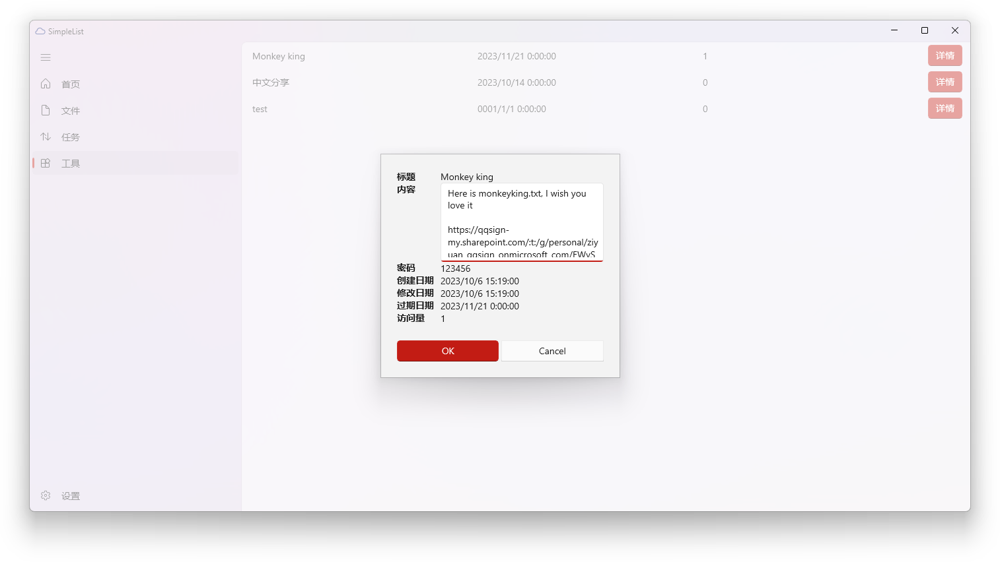

# SimpleList

English | [简体中文](./README_zh_CN.md)


SimpleList is a OneDrive files index application developed using WinUI3.

# Usage

Unzip and then double click

# Settings

Modify `SimpleList/appsettings.json` to customize the configuration.

You can set separate Azure AD Client IDs for Global (International) and China (21Vianet) environments:

```json
{
  "AzureAD": {
    "Global": {
      "ClientId": "your-global-client-id"
    },
    "China": {
      "ClientId": "your-china-client-id"
    }
  }
}
```

> **Note:** The Global and China versions of Azure AD are completely independent. You need to register your application separately on [portal.azure.com](https://portal.azure.com) (Global) and [portal.azure.cn](https://portal.azure.cn) (China/21Vianet).

# Features

- [x] Index
- [x] Download
- [x] Share
- [x] Preview
- [x] Download progress
- [x] Upload
- [ ] Automatic synchronization
- [x] Rename
- [x] Delete
- [x] Properties
- [x] Total usage
- [x] Convert to PDF
- [ ] Open in new tab
- [ ] Custom theme
- [x] Multiple accounts
- [x] i18n
- [x] Tools page
- [x] Support for Microsoft 365 operated by 21Vianet (China) and Global (International)

# Screenshots(may not be the latest version)





# Stargazers over time

[](https://starchart.cc/aiguoli/SimpleList)
