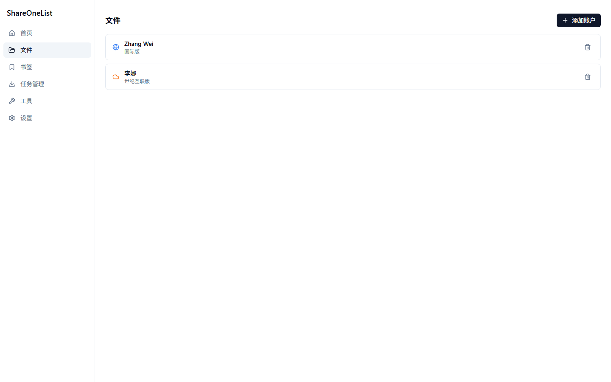
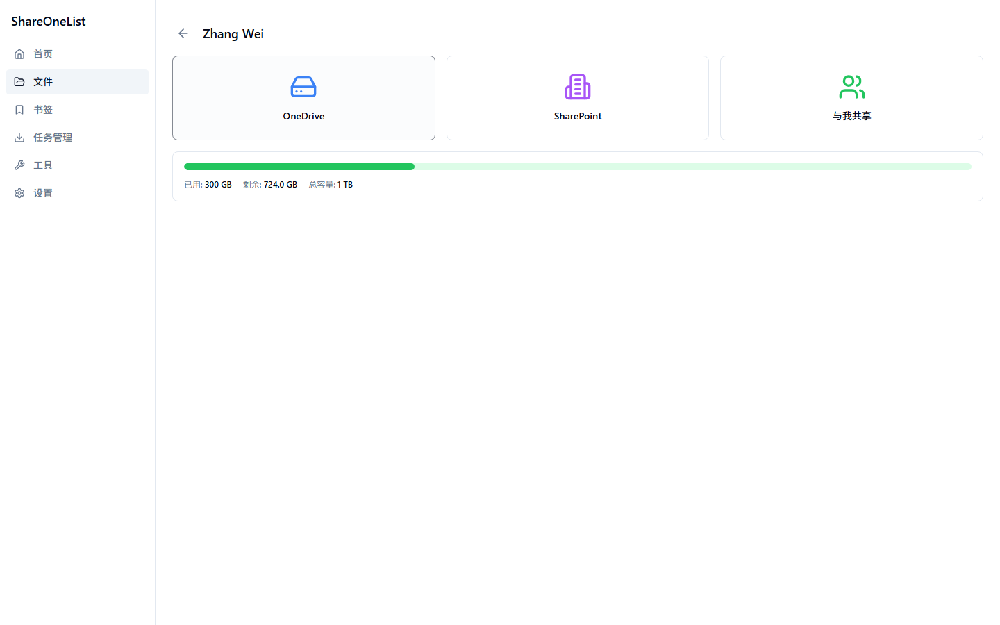
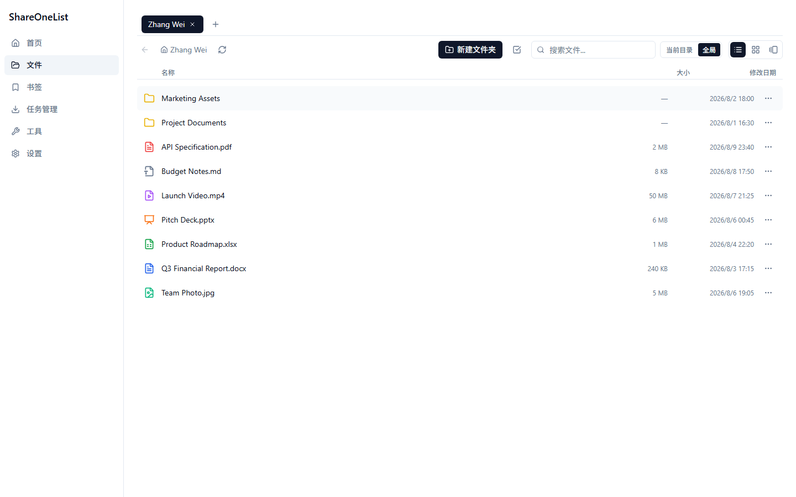
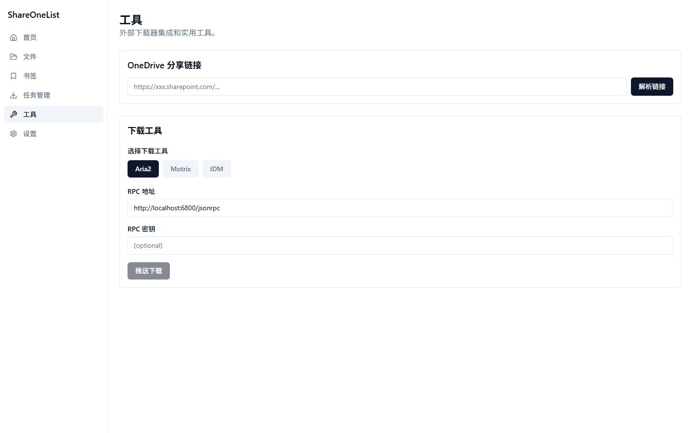
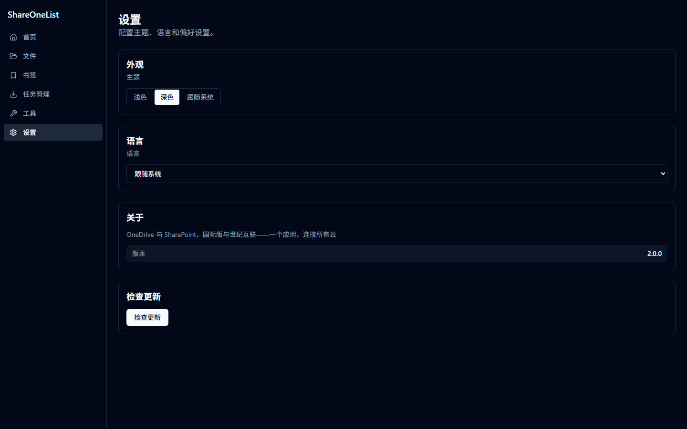

# ShareOneList

[English](./README.md) | 简体中文

> 基于 Tauri 2、Rust 和 React 的跨平台 OneDrive 与 SharePoint 文件管理客户端。

ShareOneList 是 Microsoft 365 的跨平台文件管理客户端，支持 Windows（x64 / arm64）和 macOS（Apple Silicon），统一访问 OneDrive 和 SharePoint 文档库，同时支持国际版和世纪互联版。

## 特点

- **双云支持** — 在同一个应用中管理国际版和世纪互联版 Microsoft 365 的文件
- **OneDrive + SharePoint** — 个人 OneDrive、SharePoint 站点文档库、共享文档库一站式浏览
- **多账户** — 支持添加多个不同云环境的账户
- **断点续传** — 下载中断后可恢复，重启应用后仍可继续
- **批量任务** — 一次发起的批量下载归并为一个任务，显示进度和当前下载速度
- **文件预览** — 在线预览图片、视频、Markdown 和 Office 文档
- **缩略图** — 区分文件类型图标，支持图片和视频缩略图
- **书签** — 收藏常用文件夹和文件，快速访问
- **深色 / 浅色主题** — 跟随系统主题，也可手动切换
- **多语言** — 默认跟随系统语言，可手动切换中英文

## 使用方法

1. 从 [Releases](https://github.com/ituff/ShareOneList/releases) 下载最新版本
2. 安装或运行 `ShareOneList`
3. 点击左侧菜单栏的 **文件**，然后点击 **添加网盘** 登录你的 Microsoft 账户
4. 双击网盘进入文件浏览

### macOS Gatekeeper 说明

当前 GitHub 构建的 macOS 包未签名、未公证，首次打开可能提示“应用已损坏”或“无法打开”。请先移除隔离属性，再打开应用：

```bash
curl -fsSL https://raw.githubusercontent.com/ituff/ShareOneList/main/scripts/fix-macos-gatekeeper.command | bash
```

也可以把应用拖入 `/Applications` 后手动执行：

```bash
xattr -cr /Applications/ShareOneList.app
open /Applications/ShareOneList.app
```

如果提示权限不足，请使用 `sudo xattr -cr /Applications/ShareOneList.app`。另一种方式是右键点击应用，选择“打开”，在弹窗中确认一次。辅助脚本见 [scripts/fix-macos-gatekeeper.command](./scripts/fix-macos-gatekeeper.command)。

## 配置

应用内置国际版和世纪互联版的 Azure AD 客户端 ID。如需使用自己的 Azure AD 应用，请在 [portal.azure.com](https://portal.azure.com)（国际版）和 [portal.azure.cn](https://portal.azure.cn)（世纪互联版）分别注册并在应用内配置。

## 功能列表

- [x] OneDrive 文件浏览
- [x] SharePoint 站点与文档库浏览
- [x] 国际版与世纪互联版支持
- [x] 多账户管理
- [x] 批量下载归并为一个任务
- [x] 断点续传，显示进度和下载速度
- [x] 下载时选择保存路径，并记住上次路径
- [x] 文件分享与链接生成
- [x] 文件预览（图片、视频、Markdown、Office Online）
- [x] 图片 / 视频缩略图
- [x] 书签
- [x] 重命名 / 删除 / 属性查看
- [x] 转换为 PDF
- [x] 存储容量显示
- [x] 详细 / 缩略图 / 看图布局模式
- [x] 拖拽上传
- [x] 深色 / 浅色主题
- [x] 系统语言 / 英文 / 简体中文
- [x] 应用内检查更新
- [ ] 移动版

## 截图











## 开发

```bash
cd tauri-app
npm install
npm run tauri dev
```
