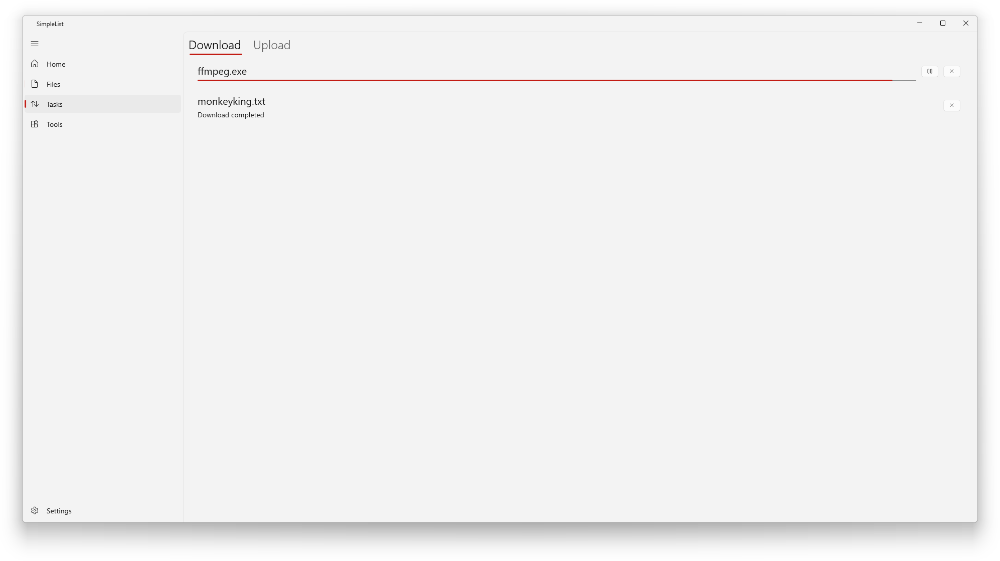
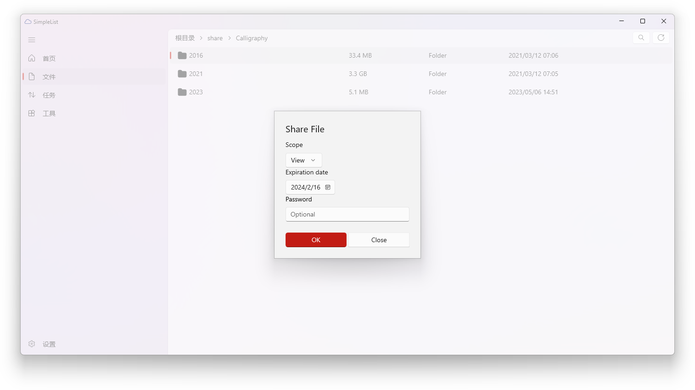

# SimpleList

[English](./README.md) | 简体中文


SimpleList 是一个使用 WinUI3 开发的 OneDrive 文件列表应用。

# 使用方法

解压后双击运行

# 配置

修改 `SimpleList/appsettings.json` 来自定义配置。

你可以分别为国际版和世纪互联版设置不同的 Azure AD 客户端 ID：

```json
{
  "AzureAD": {
    "Global": {
      "ClientId": "你的国际版客户端ID"
    },
    "China": {
      "ClientId": "你的世纪互联版客户端ID"
    }
  }
}
```

> **注意：** 国际版和世纪互联版的 Azure AD 是完全独立的体系，你需要分别在 [portal.azure.com](https://portal.azure.com)（国际版）和 [portal.azure.cn](https://portal.azure.cn)（世纪互联版）注册应用。

# 功能

- [x] 文件列表
- [x] 下载
- [x] 分享
- [x] 预览
- [x] 下载进度
- [x] 上传
- [ ] 自动同步
- [x] 重命名
- [x] 删除
- [x] 属性
- [x] 总容量
- [x] 转换为 PDF
- [ ] 新 tab 打开
- [ ] 自定义主题
- [x] 多账户
- [x] 多语言
- [x] 工具页
- [x] 支持世纪互联版（中国）和国际版

# 截图（可能不是最新版本）






# Stargazers over time

[](https://starchart.cc/aiguoli/SimpleList)
